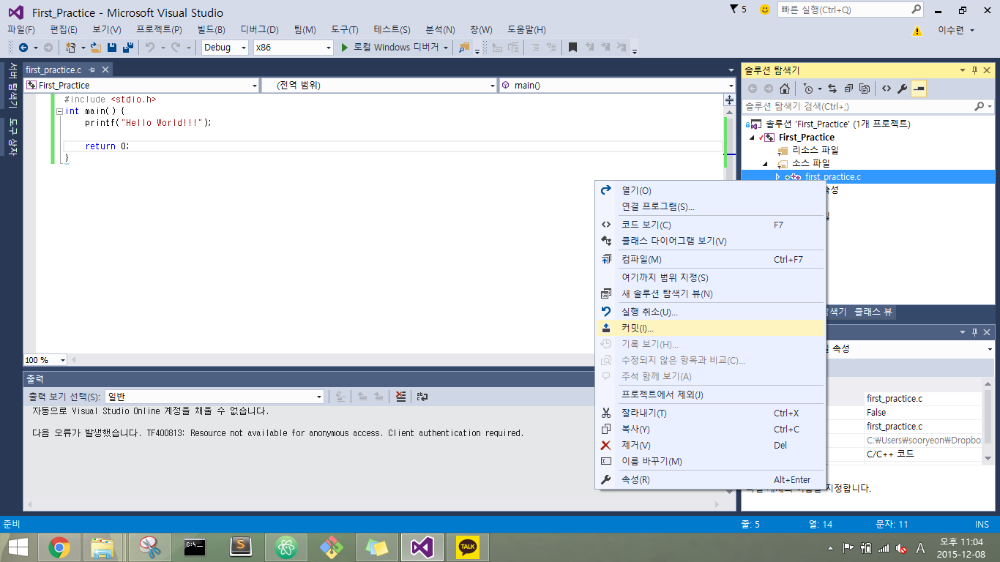
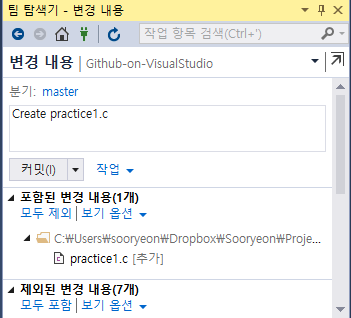
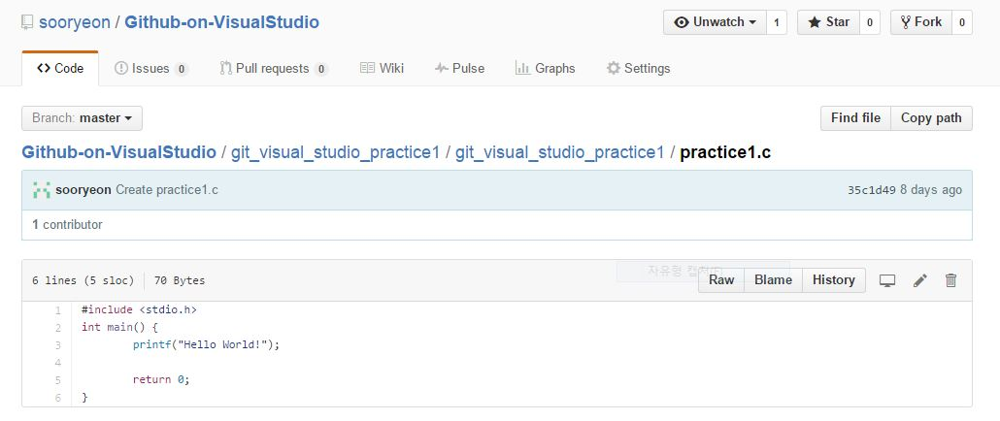

# Using GitHub on Visual Studio
1. Download extension for GitHub: 
Download Link: <a href="https://visualstudio.github.com/">GitHub Extension</a>

2. Visual Stuio을 열고 상단 메뉴에서 팀->연결관리->github connection 클릭

3. 다음 창이 뜨면 github 계정으로 로그인 

4.  
  * <b>Creating repository</b> 
  팀 탐색기에서 "Create" 버튼 클릭 
    
  생성할 repository 이름 설정, local path 설정 
  

  * <b>Cloning repository</b> 
    오른쪽에 팀 탐색기에서 'Clone' 버튼 클릭 
    

    Clone 할 github의 repository와 local directory의 위치를 선택해서 설정 
    

  * <b>Adding a new c file to gitHub</b> 
  Visual Studio로 코드 파일 생성 후 커밋 클릭 
    
  다음과 같은 창이 뜨면 변경 내용을 입력하고 commit 버튼 클릭
  

    github에 들어가면 다음과 같이 c 파일이 새롭게 생성된 것을 볼 수 있다. 
     
